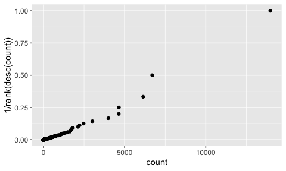
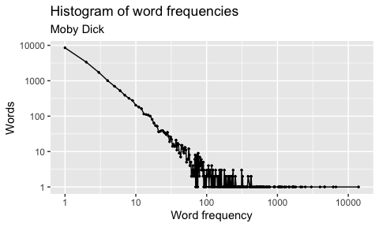
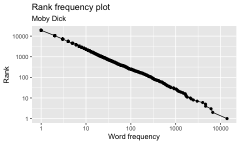
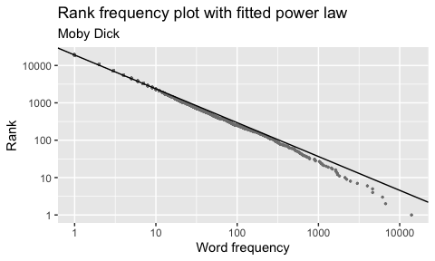
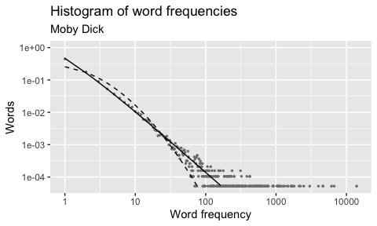
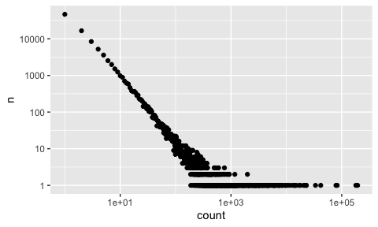
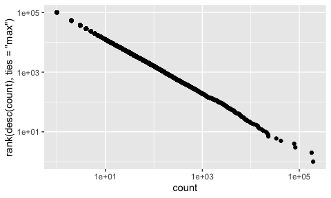

``` r
library(tidyverse)
library(here)
knitr::opts_chunk$set(fig.height = 3, fig.width = 5)
```

## What is Zipf’s Law?

### Zipf’s Law as an observational pattern

Zipf’s law is often stated as an observational pattern seen in the
relationship between the frequency and rarity of words in a text:

> “…the most frequent word will occur approximately twice as often as
> the second most frequent word, three times as often as the third most
> frequent word, etc.”  
> — <https://en.wikipedia.org/wiki/Zipf%27s_law>

Mathematically, it might be written as: \[
f \propto \frac{1}{r}
\] where \(f\) is the frequency, e.g. number of times the word appears
in a text, and \(r\) is the rarity of the word, e.g. the rank, where 1
is the most commonly used word.

``` r
moby <- read_csv(here("zipfs-law", "results", "moby_dick.csv"),
  col_names = c("word", "count")) %>% 
  filter(str_detect(word, "\\w")) # for some reason I get punctation in here?
```

For example, using the text of Moby Dick, plotting the times each word
is used in the text, versus 1/rank, you see a somewhat linear
relationship:

``` r
moby %>% 
  ggplot(aes(count, 1/rank(desc(count)))) +
  geom_point() 
```

<!-- -->

However, this plot tends to visually over-emphasize the very frequent
words — it is hard to see what is happening for words that appear less
than 500 times (better options are shown later).

A slightly more general form adds a parameter \(\alpha\) for the
exponent of the power law: \[
f \propto \frac{1}{r^\alpha}
\]

### Zipf’s Law as a statistical model

The tricky part of this, is that the above equation states an
observational pattern, but not a statistical model — it does not
explicitly describe the distribution of a random variable. Most
approaches proceed by treating the number of times a word appears,
\(x\), as the random variable, but there is more than one way to do so.
A few ways I came across:

1.  Treat \(x\) as a continuous random variable, and put a power law on
    its probability density function (PDF): \[
     f(x) = C x^{-\beta}, \quad x > x_\text{min}
     \] where \(C\) is the appropriate normalizing factor to ensure the
    density integrates to one, and \(\beta > 0\), is a parameter of the
    distribution. This also implies \(x\) has a power law on its
    complementary cumulative distribution function, a.k.a survival
    function: \[
     S(x) = P(X \ge x) =  \left(\frac{x}{x_\text{min}}\right)^{-\beta + 1}
     \]

2.  Treat \(x\) as a discrete random variable, and put a power law on
    its PDF: \[
     f(x) = P(X = x) = C x^{-\beta}, \quad x \ge x_\text{min}
     \] In this discrete case, this doesn’t imply a power law on the
    survival function of \(x\), which leads to the next option.

3.  Treat \(x\) as a discrete random variable, and put a power law on
    its survival function: \[
     S(x) = P(X \ge x) = C x^{-\beta + 1}
     \]

In all cases, the parameter \(x_\text{min}\) is some lower bound on
\(x\), without which the normalizing constants couldn’t be defined.
Also, all cases have power law behaviour in the tail with the same
exponent (i.e. \(x\) goes to infinity \(f(x) \propto 1/x^\beta\)). The
exponent, \(\beta\) is related to the exponent in the observational
relationship, \(\alpha\), by \(\beta = 1 + 1/\alpha\).

Treating \(x\) as discrete seems reasonable since it only takes integer
values, however that then leads to the question of whether choice 2. or
3. above is more appropriate. Moreno-Sánchez, Font-Clos, and Corral
(2016) explored this directly, albeit with the restriction that
\(x_\text{min} = 1\), and found 3., a power law on the survival
function, fit a larger fraction of texts in their corpus (English texts
in Project Gutenberg) than 2.

## What does data that observes Zipf’s law look like?

The above statistical models for data that obeys Zipf’s law are all
examples of power laws. In general when two variables \(x\), and \(y\)
are related through a power law: \[
y = ax^b
\] Taking logarithms of both sides, yields a linear relationship: \[
\log(y) = \log(a) + b\log(x)
\] Hence, plotting the variables on a log-log scale should reveal this
linear relationship.

However, as seen above, if we think about word frequencies as discrete
random variables, there are two distinct possibilities for where the
power law relationship occurs:

1.  Power law on the probability mass function: \[
     f(x) = P(X = x) = C x^{-\beta}, \quad x \ge x_\text{min}
     \] To approximate this with data, we estimate the probability of a
    particular word frequency, \(x\), with the proportion of words in
    our text with that frequency — or in other words, a histogram of the
    observed frequencies.
    
    For example, a histogram of word frequency of Moby Dick:
    
    ``` r
    moby %>% 
      group_by(count) %>% 
      count() %>% 
      ggplot(aes(count, n)) +
        geom_line() +
        geom_point(size = 0.5) +
        scale_x_log10() +
        scale_y_log10() +
        labs(
          title = "Histogram of word frequencies",
          subtitle = "Moby Dick",
          x = "Word frequency",
          y = "Words")
    ```
    
    <!-- -->
    
    There are about 10,000 words that appear once, 1000 words that
    appear 4 times, 100 words that appear 20 times, etc.

2.  Power law on the survival function: \[
    S(x) = P(X \ge x) = C x^{-\beta + 1}
    \] Again, to approximate this with data, we replace the probability
    with an observed proportion: in this the proportion of words that
    appear more frequently that a given frequency \(x\).
    
    This could be done explicitly:
    
    ``` r
    survival <- function(x, data){ 
      mean(data >= x) 
    }
    moby %>% 
      mutate(
        survival = map_dbl(count, survival, data = count)
      ) %>% 
      ggplot(aes(count, survival)) +
      geom_line() +
      scale_x_log10() +
      scale_y_log10()
    ```
    
    But it turns out this is an exact linear transform of rank, so it is
    much easier to plot rank vs frequency:
    
    ``` r
    moby %>% 
      ggplot(aes(count, rank(desc(count), ties = "max"))) +
      geom_line() +
      geom_point() +
      scale_x_log10() +
      scale_y_log10() +
        labs(
          title = "Rank frequency plot",
          subtitle = "Moby Dick",
          x = "Word frequency",
          y = "Rank")
    ```
    
    <!-- -->

## How do we fit data to Zipf’s Law?

To fit data to Zipf’s law we need to estimate the exponent in the power
law.

Clauset, Shalizi, and Newman (2009) recommended fitting via maximum
likelihood and describe doing so if a power law is assumed on the
probability mass function.

Moreno-Sánchez, Font-Clos, and Corral (2016), referencing Clauset,
Shalizi, and Newman (2009), also use maximum likelihood but also do so
for a power law assumed on the survival function.

### Moby Dick Example

If we place a power law on the survival function, assuming
\(x_\text{min} = 1\): \[
f(x; \beta) = \frac{1}{x}^{\beta - 1} - \frac{1}{x + 1}^{\beta - 1}
\] Then the log likelihood for \(x_1, \ldots, x_n\) independent and
identically distributed word frequencies is: \[
l(\beta) =  \log \left( \prod_{i = 1}^{n} f(x_i; \beta) \right)
\]

We can numerically maximize this to get a maximum likelihood estimate
for \(\beta\).

Negative (since R functions like to minimize, not maximize) log
likelihood for \(x_1, \ldots, x_n\) word frequencies:

``` r
# negative log likelihood l(beta) = -sum(log(f(x)))
nlog_likelihood <- function(beta, x){
  - sum(log((1/x)^(beta - 1) - (1/(x + 1))^(beta - 1)))
}
```

Estimating \(\beta\) for Moby Dick:

``` r
# Optimizer settings from @moreno2016large
mle <- optim(1.5, nlog_likelihood, x = moby$count, 
  lower = 1, upper = 4, 
  hessian = TRUE, method = "Brent")

beta_hat <- mle$par
# Standard error from ML theory
se <- sqrt(1/mle$hessian)[1, 1]

# Asymptotic 95% CI
ci <- beta_hat + c(-1, 1) * 1.96 * se
```

For Moby Dick, estimate power law exponent, \(\beta\), is between 1.89
and 1.92 (95% asymptotic confidence interval).

``` r
n <- nrow(moby)
moby %>% 
  ggplot(aes(count, rank(desc(count), ties = "max"))) +
  geom_point(size = 0.5, color = "grey50") +
  geom_abline(
    intercept = log10(n),
    slope = -beta_hat + 1
  ) + 
  scale_x_log10() +
  scale_y_log10() +
    labs(
      title = "Rank frequency plot with fitted power law",
      subtitle = "Moby Dick",
      x = "Word frequency",
      y = "Rank"
      )
```

<!-- -->

Clauset, Shalizi, and Newman (2009) give some closed form approximations
to the MLEs, but suggest they are only accurate for
\(x_\text{min} \ge 6\).

## Why should (or shouldn’t we) fit a Log Normal?

Newman (2005) has good summary for data generating mechanisms that would
result in power law or log normally distributed variables.

Most convincing mechanisms:

  - **Power law behavior** Essentially a “monkey’s on typewriters”
    argument, suggests if letters (including spaces) are typed randomly,
    then the distribution of word frequencies would have a power law. A
    contradiction arises when considering what this mechanism would
    predict for the number of unique words as the length of a text
    grows, but this is partially resolved by considering the basic
    components of words as something larger than individual letters. *I
    think this argument is made for continuous frequencies, does it
    point specifically to one of the formulations for discrete
    frequencies?*

  - **Log Normal** Often arises when multiplying random things together.
    Argument comes considering log of a product as sum of the logs, and
    sums often obey Central Limit Theorem.

**Empirical Arguments**

As explained by Newman (2005) a Log Normally distributed random
variable, \(x\) will have log probability density function that is
quadratic in \(\log x\): \[
\log{f(x)} = -\frac{(\log x)^2}{2\sigma^2} + \left(\frac{\mu}{\sigma^2} -1 \right) \log x - \frac{\mu^2}{2\sigma^2}
\] Or, in other words, on log-log scale the PDF will be quadratic. On a
small regions this quadratic may be well approximated by a linear
function of \(\log x\).

``` r
# mles for log-normal fit to moby dick
mu_hat <- mean(log(moby$count))
sigma_hat <- sd(log(moby$count))* sqrt((n-1)/n)
```

Comparison of resulting curves:

``` r
moby %>% 
  group_by(count) %>% 
  count() %>% 
  ungroup() %>% 
  mutate(
    obs_prop = n/sum(n),
    expected_zipfs = count^(1 - beta_hat) - 
      (count + 1)^(1 - beta_hat),
    expected_lognormal = dlnorm(count, meanlog = mu_hat,
      sdlog = sigma_hat)
  ) %>% 
  ggplot(aes(count, obs_prop)) +
    geom_point(size = 0.5, color = "grey50") +
    geom_line(aes(y = expected_zipfs)) +
    geom_line(aes(y = expected_lognormal), linetype = "dashed") +
    scale_x_log10() +
    scale_y_log10(limits = c(1/n, 1)) +
    labs(
      title = "Histogram of word frequencies",
      subtitle = "Moby Dick",
      x = "Word frequency",
      y = "Words") 
```

    ## Warning: Removed 144 rows containing missing values (geom_path).

    ## Warning: Removed 213 rows containing missing values (geom_path).

<!-- -->

The power law on the survival function gives the following form on the
probability mass function (with \(x_\text{min} = 1\)): \[
f(x) = x^{1 - \beta} - (x + 1)^{1 - \beta}
\] This isn’t linear on log-log scales, but given the range of the data,
e.g. words in Moby Dick, it doesn’t have a huge amount of curvature.

## How can I simulate data that follows a power law?

From Moreno-Sánchez, Font-Clos, and Corral (2016), use the inverse
transform method:

1.  generate \(u\) from uniform distribution on
    \((0, 1/x_\text{min}^{\beta - 1})\)
2.  calculate \(y = 1/u^{1/(\beta - 1)}\)
3.  take \(x = \lfloor y\rfloor\)

When \(x_\text{min} = 1\), and with some simplification:

1.  generate \(u\) from uniform distribution on \((0, 1)\)
2.  calculate \(y = u^{1/(1 - \beta)}\)
3.  take \(x = \lfloor y\rfloor\)

<!-- end list -->

``` r
nsim <- 100000
beta <- 1.9

inverse_ccdf <- function(x, beta){
  x^(1/(1 - beta))
}

sim_counts <- floor(inverse_ccdf(runif(nsim), beta = beta))

tibble(count = sim_counts) %>% 
  group_by(count) %>% 
  count() %>% 
  ggplot(aes(x = count, y = n)) + 
    geom_point() +
    scale_x_log10() +
    scale_y_log10()
```

<!-- -->

``` r
tibble(count = sim_counts) %>% 
  ggplot(aes(count, rank(desc(count), ties = "max"))) + 
    geom_point() +
    scale_x_log10() +
    scale_y_log10()
```

<!-- -->

``` r
mle_sim <- optim(1.5, nlog_likelihood, x = sim_counts, 
  lower = 1, upper = 4, 
  hessian = TRUE, method = "Brent")
```

## References

<div id="refs" class="references">

<div id="ref-clauset2009power">

Clauset, Aaron, Cosma Rohilla Shalizi, and Mark EJ Newman. 2009.
“Power-Law Distributions in Empirical Data.” *SIAM Review* 51 (4).
SIAM: 661–703.

</div>

<div id="ref-moreno2016large">

Moreno-Sánchez, Isabel, Francesc Font-Clos, and Álvaro Corral. 2016.
“Large-Scale Analysis of Zipf’s Law in English Texts.” *PloS One* 11
(1). Public Library of Science: e0147073.

</div>

<div id="ref-newman2005power">

Newman, Mark EJ. 2005. “Power Laws, Pareto Distributions and Zipf’s
Law.” *Contemporary Physics* 46 (5). Taylor & Francis: 323–51.

</div>

</div>
